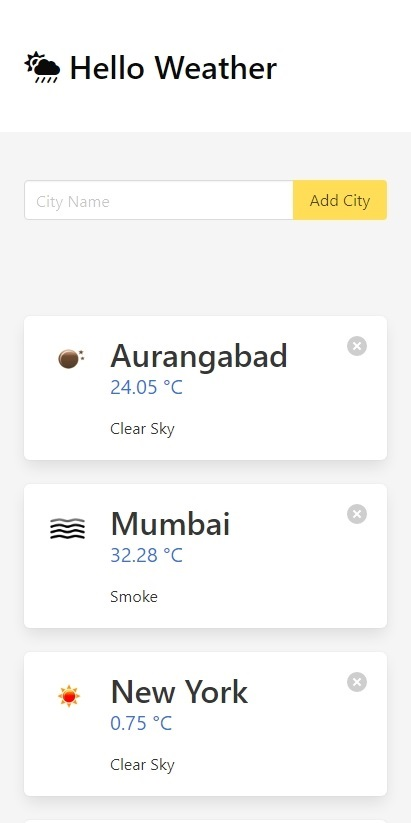

# HelloWeather

 A Weather Forecasting Web Application in Django. Uses OpenWeatherMap API for fetching weather data of input cities. This is very basic application. I made it to get an insight of how to work with APIs.

### Desktop View


### Mobile View


### Dependencies
>python==3.7.4  
Django==2.2.7    
requests==2.22.0   


### Steps to Execute 
#### 1. Git clone HelloWeather 
```bash
git clone https://github.com/adityaborgaonkar/HelloWeather.git
```
#### 2. cd into HelloWeather 
```bash
cd HelloWeather
```
#### 3. Create virtual environment 
```bash
python -m venv virtualenv
```
#### 4. Activate virtual environment 
```bash
virtualenv\Scripts\activate
```
#### 5. Install dependencies
```bash
pip install requirements.txt
```
#### 6. Run HelloWeather 
```bash
python manage.py runserver
```
Go to your browser at http://127.0.0.1:8000

Enter cities and enjoy the °C!


